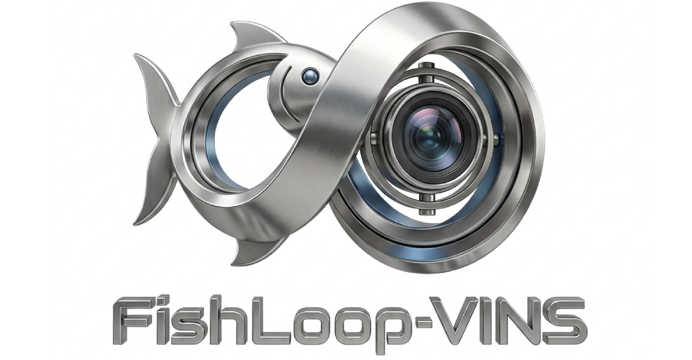
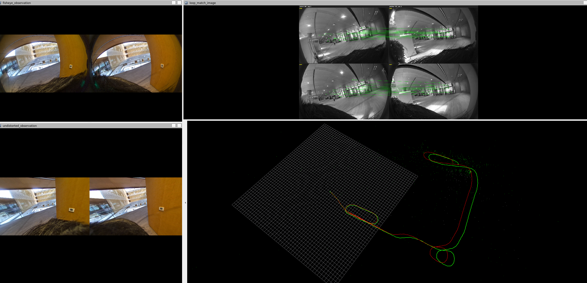

<h2 align="center">FishLoop-VINS: A Real-Time Dual-Fisheye Visual-Inertial SLAM System<br>with Multi-View Loop Closure</h2>

<h3 align="center">
  <a href="https://luohongkun.top/scholar/">Hongkun Luo</a>
</h3>

<p align="center">
  <a href="https://github.com/luohongk/FishLoop-VINS">Project Repository</a> |
  <a href="video/FishLoop_VINS.mp4">Demo Video</a> |
  English |
  <a href="README_CN.md">简体中文</a>
</p>

<p align="center">
  <a href="https://github.com/luohongk/FishLoop-VINS">
    
  </a>
  <a href="https://isocpp.org/">
    
  </a>
  <a href="http://wiki.ros.org/noetic">
    
  </a>
  <a href="https://developer.nvidia.com/cuda-toolkit">
    
  </a>
  <a href="https://github.com/luohongk/FishLoop-VINS">
    
  </a>
  <a href="https://github.com/dorian3d/DBoW2">
    
  </a>
  <a href="LICENSE">
    
  </a>
  <a href="https://www.zhiyuteam.com/">
    
  </a>
</p>

<div align="center">
  
</div>

---

## 🐟 Project Overview

FishLoop-VINS is a dual-fisheye visual-inertial localization system running on ROS 1. Building on fisheye VIO, the system adds loop-closure detection, geometric verification, and pose graph optimization for ultra-wide-angle cameras. It performs real-time state estimation using stereo fisheye images and IMU measurements, while multi-view loop-closure fusion reduces accumulated drift during long-term operation.

This repository provides complete support for dual-fisheye EUCM (Extended Unified Camera Model) cameras. Each fisheye camera can be unfolded into multiple canonical perspective views for feature tracking, loop-candidate retrieval, and matching. Candidate loop closures are then geometrically verified using the original EUCM pixels and bearing vectors, avoiding the incorrect treatment of fisheye images as ordinary pinhole images.

## 🎬 Runtime Results

<div align="center">
  
</div>

[Watch the demo video](video/FishLoop_VINS.mp4)

## 🧰 Software and Hardware Requirements

Using the Docker environment provided in this repository is recommended to avoid version conflicts among ROS, OpenCV, CUDA, and Ceres. This repository currently supports only devices equipped with an NVIDIA GPU.

- Ubuntu 20.04
- ROS Noetic
- NVIDIA GPU with a compatible host driver
- [Docker](https://www.docker.com/)
- [NVIDIA Container Toolkit](https://docs.nvidia.com/datacenter/cloud-native/container-toolkit/latest/install-guide.html)
- CUDA 11.8
- OpenCV 4.5.5 + CUDA
- Ceres Solver, Eigen3, Boost, and OpenMP
- libSGM 3.0.0 for the CUDA depth-estimation path

[NVIDIA Container Toolkit](https://docs.nvidia.com/datacenter/cloud-native/container-toolkit/latest/install-guide.html) must be installed before running the system.

## 🚀 Quick Start: Docker GPU Version

### 📥 1. Clone the Repository

```bash
git clone https://github.com/luohongk/FishLoop-VINS.git
cd FishLoop-VINS
```

### 🐳 2. Obtain the Image

#### 🛠️ Option 1: Build Locally

The default GPU architecture is Ada `8.9`, which is suitable for the RTX 40 series:

```bash
docker compose --profile gpu build
```

To support another GPU, set `CUDA_ARCH` and `CUDA_ARCH_PTX` according to the following table:

| GPU architecture | Common GPUs         | Architecture value |
| ---------------- | ------------------- | ------------------ |
| Pascal           | GTX 10 series       | `6.1`              |
| Volta            | V100                | `7.0`              |
| Turing           | RTX 20 series, T4   | `7.5`              |
| Ampere           | RTX 30 and A series | `8.6`              |
| Ada              | RTX 40 series       | `8.9`              |

For example, use the following command for the Ampere architecture:

```bash
CUDA_ARCH=8.6 CUDA_ARCH_PTX=8.6 docker compose --profile gpu build
```

#### ☁️ Option 2: Pull from Docker Hub

```bash
docker pull luohongkun0715/fishloop_vins:gpu
docker tag luohongkun0715/fishloop_vins:gpu fishloop_vins:gpu
```

### 📦 3. Start the Container

Allow the container to access the host X11 server:

```bash
xhost +local:root
```

Mount the repository and data directories into the container:

```bash
docker run -it --rm \
  --gpus all \
  --network=host \
  --privileged \
  -v /tmp/.X11-unix:/tmp/.X11-unix:rw \
  -e DISPLAY="$DISPLAY" \
  -e QT_X11_NO_MITSHM=1 \
  -v /path/to/FishLoop-VINS:/root/catkin_ws/src/fishloop_vins \
  -v /path/to/data:/data \
  --name fishloop_vins_gpu \
  -w /root/catkin_ws \
  fishloop_vins:gpu
```

Replace the following paths:

- `/path/to/FishLoop-VINS`: the absolute path to the FishLoop-VINS repository
- `/path/to/data`: the absolute path to the directory containing the rosbag data

Example command used in the development environment for this repository:

```bash
xhost +local:root && docker run -it --rm \
  --gpus all \
  --network=host \
  --privileged \
  -v /tmp/.X11-unix:/tmp/.X11-unix:rw \
  -e DISPLAY="$DISPLAY" \
  -e QT_X11_NO_MITSHM=1 \
  -v /home/lhk/workspace/FishLoop-VINS:/root/catkin_ws/src/fishloop_vins \
  -v /home/lhk/data:/data \
  --name fishloop_vins_gpu \
  -w /root/catkin_ws \
  fishloop_vins:gpu
```

### 🔨 4. Build Inside the Container

The GPU Dockerfile provides all required dependencies, but the mounted source code must still be compiled in the container:

```bash
cd /root/catkin_ws
source /opt/ros/noetic/setup.bash
catkin_make -DCMAKE_POLICY_VERSION_MINIMUM=3.5 -j8
source devel/setup.bash
```

### 🐠 5. Start FishLoop-VINS

Continue in the current container terminal:

```bash
cd /root/catkin_ws
source devel/setup.bash
roslaunch fishloop_vins vins_fisheye_loop.launch
```

By default, this launch file starts the following components:

- `fishloop_vins_node_fisheye`: dual-fisheye VIO
- `loop_fusion_node`: loop-closure detection and pose graph optimization
- RViz: trajectory, loop-closure, and map visualization

### ▶️ 6. Play the rosbag

Sample data: [Google Drive: example.bag](https://drive.google.com/file/d/173pJxOWuc-TGzYazSCw-WAJ2W-pfcllE/view?usp=sharing)

Open another terminal on the host, enter the same container, and play the data:

```bash
docker exec -it fishloop_vins_gpu bash
rosbag play /data/example.bag --clock -r 0.3
```

## 🗺️ Trajectory Output

Default output directory:

```text
/root/catkin_ws/src/fishloop_vins/data
```

Because the repository is mounted into the container, the generated files also appear in the repository's `data/` directory on the host.

| File                | Contents                                                        |
| ------------------- | --------------------------------------------------------------- |
| `data/vio.csv`      | Raw frame-by-frame VIO trajectory, including velocity            |
| `data/vio_loop.csv` | Keyframe trajectory optimized by the loop-closure pose graph     |
| `data/pose_graph/`  | Optional persistent data for the pose graph, keyframes, and descriptors |

`vio.csv` field format:

```text
timestamp_ns,px,py,pz,qw,qx,qy,qz,vx,vy,vz
```

`vio_loop.csv` field format:

```text
timestamp_ns,px,py,pz,qw,qx,qy,qz
```

## 💖 Acknowledgments

FishLoop-VINS is based on and inspired by the following excellent open-source projects:

- [VINS-Fusion](https://github.com/HKUST-Aerial-Robotics/VINS-Fusion): the foundational framework for visual-inertial estimation and loop fusion
- [VINS-Fisheye](https://github.com/HKUST-Aerial-Robotics/VINS-Fisheye): the foundational fisheye VINS implementation
- [DBoW2](https://github.com/dorian3d/DBoW2): bag-of-words-based place recognition
- [Ceres Solver](http://ceres-solver.org/): nonlinear least-squares optimization
- [libSGM](https://github.com/fixstars/libSGM): CUDA-accelerated semi-global stereo matching

## 📜 License

The [LICENSE](LICENSE) file in the repository root declares the project under the Apache License 2.0. Note that some ROS package metadata and source files inherited or modified from upstream projects may specify different licenses. Before public distribution or commercial use, verify and align the project's license metadata and comply with the license requirements of all third-party components.
